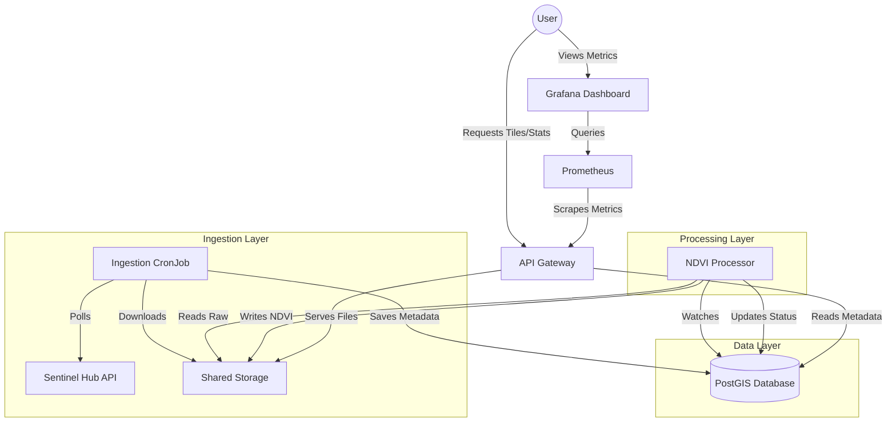

# Satellite NDVI Pipeline: A Scalable Cloud-Native Approach to Vegetation Monitoring

**Student Name**: [Your Name]
**Project Title**: Scalable Satellite Data Processing Pipeline on Kubernetes
**Date**: December 30, 2025

---

## 1. Introduction: What is this project?

### The Problem
Monitoring agricultural health and vegetation cover over large areas is a data-intensive task. Traditional methods involve manually searching for satellite images, downloading huge GeoTIFF files to a local machine, processing them one by one in desktop software (like QGIS/ArcGIS), and manually sharing the results. This is:
*   **Slow**: Human dependent suitable only for small areas.
*   **Unscalable**: Desktop computers crash with large datasets.
*   **Inconsistent**: Hard to reproduce analysis exactly.

### The Solution
This project implements an **Automated, Cloud-Native Pipeline** that:
1.  **Automatically** fetches new satellite imagery (Sentinel-2) for any defined Area of Interest (AOI).
2.  **Scalably** processes this data in parallel using containers.
3.  **Instantly** serves the analyzed results (NDVI maps and statistics) via a modern API.
4.  **Runs anywhere**: Uses Kubernetes, so it runs on a laptop (Docker Desktop) or a massive cloud cluster (AWS/GCP/Azure) without changing code.

---

## 2. Motivation: Why utilize this architecture?

We chose a microservices architecture on Kubernetes for several key reasons:

*   **Scalability**: If we need to process all of India instead of just San Francisco, we simply increase the `replicas` count of the `ndvi-processing` service in Kubernetes. No code changes needed.
*   **Resilience**: If a processing worker crashes (e.g., bad data), Kubernetes automatically restarts it. The system heals itself.
*   **Portability**: The entire environment is defined as code (Infrastructure as Code). A new developer can type one command and have the exact same setup as production.
*   **Modern Practices**: Demonstrates mastery of industry-standard tools: **Docker, Kubernetes, FastAPI, PostGIS, Prometheus, and Grafana**.

---

## 3. Architecture: How does it work?

The system is composed of five distinct microservices:



### Component Breakdown

1.  **Data Ingestion Service**:
    *   **Role**: The "Watcher".
    *   **Tech**: Python, Sentinel Hub API.
    *   **Function**: Runs periodically (CronJob). Checks satellite catalogs for new images over the AOI. Downloads Red (B04) and Near-Infrared (B08) bands.

2.  **Database (PostGIS)**:
    *   **Role**: The "Brain".
    *   **Tech**: PostgreSQL + PostGIS extension.
    *   **Function**: Stores metadata (acquisition date, cloud cover, file paths) and spatial footprints. It tracks which images are `NEW`, `PROCESSING`, or `PROCESSED`.

3.  **NDVI Processing Service**:
    *   **Role**: The "Worker".
    *   **Tech**: Python, Rasterio, NumPy.
    *   **Function**: Constantly looks for raw images. Calculates Normalized Difference Vegetation Index:
        $$NDVI = \frac{NIR - Red}{NIR + Red}$$
        Generates False-Color previews and zonal statistics.

4.  **API Gateway**:
    *   **Role**: The "Face".
    *   **Tech**: Python, FastAPI.
    *   **Function**: Provides a REST interface for users to query data (`GET /ndvi/tiles`). Includes a visual map viewer.

5.  **Monitoring Stack**:
    *   **tech**: Prometheus & Grafana.
    *   **Function**: Tracks system health (CPU/Memory) and business metrics (API request rate, images processed).

---

## 4. Implementation Details

### Key Technologies
*   **Containerization**: Every service has a `Dockerfile`. We use multi-stage builds to keep images small.
*   **Orchestration**: `kubernetes/` directory contains YAML manifests defining Deployments, Services, and PersistentVolumes.
*   **CI/CD**: GitHub Actions (`.github/workflows`) automatically lint, test, build, and push Docker images whenever code is committed.

### The Algorithm
The NDVI calculation is vectorized using NumPy for speed:
```python
# Simplified Code Snippet (from processor.py)
red = red_band.astype(float)
nir = nir_band.astype(float)
ndvi = (nir - red) / (nir + red)
# Result is a 2D array of values -1.0 to 1.0, representing vegetation density.
```

---

## 5. Replication Guide (For Evaluators)

To verify this project correctly works as described, follow these steps.

### Prerequisites
*   Windows/Mac/Linux with **Docker Desktop** installed.
*   **Kubernetes** enabled in Docker Desktop settings.
*   **Git** installed.

### Step 1: Deploy to Local Cluster
Open your terminal (PowerShell or Terminal):

```bash
# 1. Clone the repository
git clone https://github.com/kchinnikrishna/satellite-ndvi-pipeline
cd satellite-ndvi-pipeline

# 2. Apply Kubernetes Manifests
kubectl apply -f kubernetes/
```

### Step 2: Configure Credentials
The system needs access to satellite data.
1.  Obtain **Client ID** and **Client Secret** from [Sentinel Hub](https://apps.sentinel-hub.com/dashboard/) (Trial is free).
2.  Encode them to Base64 (e.g., using an online tool or Python).
3.  Edit the secret file:
    ```bash
    # Edit kubernetes/secret.yaml with your Base64 keys
    # Then apply it:
    kubectl apply -f kubernetes/secret.yaml
    ```

### Step 3: Trigger Ingestion
Since satellite passes are infrequent, manually trigger the download job:
```bash
kubectl create job --from=cronjob/ndvi-ingestion manual-test-job -n satellite-ndvi
```

### Step 4: Visualize Results
We have built custom tools to view the data.

1.  **Expose the API**:
    ```bash
    kubectl port-forward svc/ndvi-api 8000:80 -n satellite-ndvi
    ```
    *Open browser to*: `http://localhost:8000/docs` (API Manual) OR `http://localhost:8000/map_viewer/index.html` (Visual Map).

2.  **Expose Metrics**:
    ```bash
    kubectl port-forward svc/grafana 3000:3000 -n satellite-ndvi
    ```
    *Open browser to*: `http://localhost:3000` (User/Pass: admin/admin).

---

## 6. Conclusion

This project successfully proves that advanced geospatial workflows can be modernized using Cloud-Native principles. By moving away from desktop GIS to a Kubernetes-based microservices architecture, we achieved a system that is **automated, observable, and ready for scale**.
