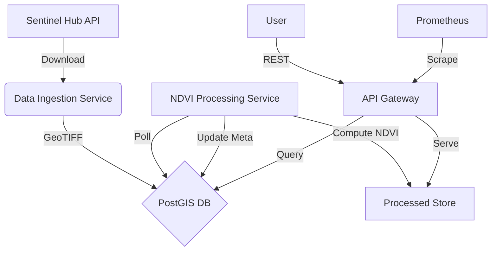

# Satellite NDVI Pipeline

An end-to-end cloud-native system that downloads Sentinel-2 imagery, computes NDVI (Normalized Difference Vegetation Index), stores results in PostGIS, and exposes them via FastAPI. Geared for deployment on Kubernetes.

## Features
- **Automated Ingestion**: Fetches Sentinel-2 imagery using Sentinel Hub / GEE.
- **Geospatial Processing**: Computes NDVI, generates color previews, and calculates vector statistics (mean, histogram).
- **Spatial Database**: Stores metadata and results in PostGIS.
- **API Gateway**: REST API to query tiles and statistics.
- **Observability**: Prometheus & Grafana stack for monitoring.
- **GitOps Ready**: Kubernetes manifests and CI/CD workflows included.

## Architecture



## Quick Start (Local Docker Compose)

1.  **Clone the repository**:
    ```bash
    git clone https://github.com/kchinnikrishna/satellite-ndvi-pipeline.git
    cd satellite-ndvi-pipeline
    ```

2.  **Configure Environment**:
    Copy `.env.example` to `.env` and fill in your credentials.
    ```bash
    cp .env.example .env
    # Edit .env with your SENTINEL_HUB creds
    ```

3.  **Run with Docker Compose**:
    ```bash
    docker compose up --build -d
    ```

4.  **Access Services**:
    - **API Docs**: [http://localhost:8000/docs](http://localhost:8000/docs)
    - **Database**: Port `5432`

## Deployment (Kubernetes)

1.  **Secrets**:
    Update `kubernetes/secret.yaml` with your base64 encoded credentials.

2.  **Deploy**:
    ```bash
    kubectl apply -f kubernetes/
    ```

3.  **Monitor**:
    - **Prometheus**: Port 9090
    - **Grafana**: Port 3000

## Development

- **Tests**: Run unit tests with `python -m unittest discover tests`.
- **Lint**: Uses `flake8`.

## License
MIT
