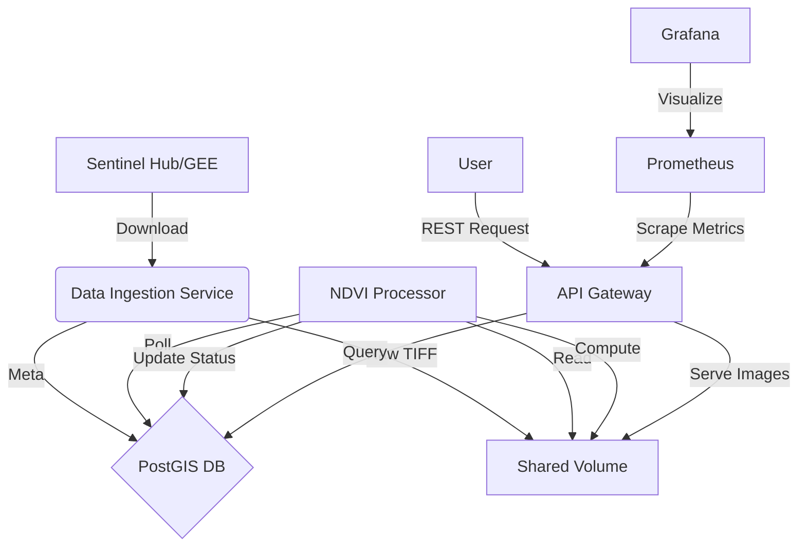

# 🛰️ Satellite NDVI Pipeline


An end-to-end cloud-native system that transforms Sentinel-2 satellite imagery into vegetation health insights (NDVI). Designed for scalability using Microservices, Docker, and Kubernetes.

## 🌟 Features

*   **Managed Ingestion**: Automatically searches and downloads Sentinel-2 imagery via Sentinel Hub / Google Earth Engine.
*   **Geospatial Processing Engine**: High-performance NDVI calculation using `rasterio` and `numpy`.
    *   Generates False-Color and NDVI colorized previews.
    *   Computes zonal statistics (min, max, mean, histograms).
*   **Spatial Database**: leverages **PostGIS** for efficient spatial queries and metadata storage.
*   **Modern API**: **FastAPI** gateway exposing REST endpoints for tiles and analytics.
*   **Observability**: Full monitoring stack with **Prometheus** metrics and **Grafana** dashboards.
*   **GitOps Ready**: Comprehensive **Kubernetes** manifests and **GitHub Actions** CI/CD pipelines.

## 🏗️ Architecture

The system is composed of loose coupled microservices:



## 📂 Project Structure

```
satellite-ndvi-pipeline/
├── api_gateway/        # FastAPI application
├── data_ingestion/     # Sentinel download logic
├── ndvi_processing/    # Image processing worker
├── database/           # SQL init scripts
├── kubernetes/         # K8s Manifests (Deployments, Services)
├── monitoring/         # Prometheus & Grafana config
├── shared/             # Common DB models and utils
├── tests/              # Unit tests
├── docker-compose.yml  # Local dev orchestration
└── .github/workflows/  # CI/CD pipelines
```

## 🚀 Quick Start

### Prerequisites
*   Docker & Docker Compose
*   Sentinel Hub Account (Client ID & Secret)

### Local Development

1.  **Clone the Repo**
    ```bash
    git clone https://github.com/kchinnikrishna/satellite-ndvi-pipeline.git
    cd satellite-ndvi-pipeline
    ```

2.  **Environment Setup**
    ```bash
    cp .env.example .env
    # Open .env and add your SH_CLIENT_ID and SH_CLIENT_SECRET
    ```

3.  **Run with Docker Compose**
    ```bash
    docker compose up --build -d
    ```

4.  **Explore**
    *   **API Documentation**: [http://localhost:8000/docs](http://localhost:8000/docs)
    *   **Database**: `localhost:5432` (User: `user`, Pass: `password`, DB: `ndvi_db`)
    *   **Grafana**: [http://localhost:3000](http://localhost:3000) (Default user/pass: `admin`/`admin`)

## ☸️ Kubernetes Deployment

1.  **Configure Secrets**
    Edit `kubernetes/secret.yaml` with your base64-encoded credentials.

2.  **Deploy Manifests**
    ```bash
    kubectl apply -f kubernetes/
    ```

3.  **Verify**
    ```bash
    kubectl get pods -n satellite-ndvi
    ```

## 🛠️ Tech Stack

*   **Language**: Python 3.11
*   **Web Framework**: FastAPI
*   **Data Processing**: Rasterio, NumPy, GDAL
*   **Database**: PostgreSQL 16 + PostGIS 3.4
*   **Infrastructure**: Docker, Kubernetes
*   **Monitoring**: Prometheus, Grafana

## 🤝 Contributing

1.  Fork the repository.
2.  Create a feature branch (`git checkout -b feature/amazing-feature`).
3.  Commit your changes (`git commit -m 'Add amazing feature'`).
4.  Push to the branch (`git push origin feature/amazing-feature`).
5.  Open a Pull Request.

## 📜 License

Distributed under the MIT License. See `LICENSE` for more information.
